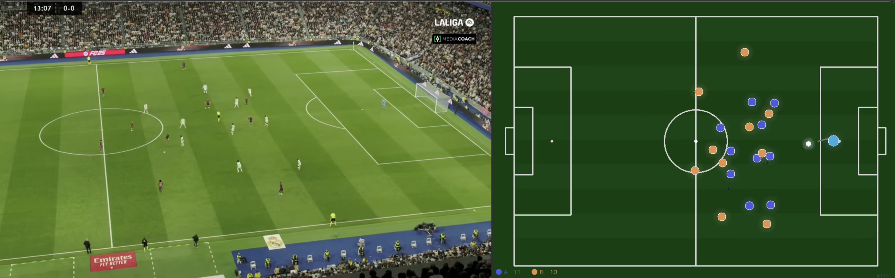

# Football Tracking System 🎯

A computer vision pipeline that transforms football broadcast footage into 2D tactical visualizations using object detection and player tracking.

## Overview

This system takes a football video clip and produces a side-by-side output showing the original footage alongside a clean 2D top-down representation of the pitch with all detected players and the ball.

```
Input:  Football video clip (broadcast/tactical camera)
Output: 2D pitch visualization with team-colored player dots
```



## Features

- **YOLOv9e Detection** — State-of-the-art object detection trained on football-specific data (ball, goalkeeper, player, referee)
- **ByteTrack** — Stable player IDs across frames with team assignment locking after 15 frames
- **Homography Calibration** — Manual pitch point mapping with Hough Transform line detection assistance
- **K-Means Team Assignment** — Automatic team color clustering with vote-based stabilization
- **Ball Interpolation** — Smooth ball trajectory even when briefly undetected (up to 20 frames)
- **EMA Smoothing** — Exponential moving average for stable player positions on the 2D pitch
- **Modern 2D Rendering** — Glow effects, player traces, and side-by-side output

## Pipeline

```bash
# Step 1 — Calibrate (once per clip)
python3 tracker/calibrate.py \
    --clip clips/match.mp4 \
    --model models/football_v3.pt

# Step 2 — Track
python3 tracker/track.py \
    --clip clips/match.mp4 \
    --calibration output/calibration_match.json \
    --model models/football_v3.pt

# Step 3 — Visualize
python3 visualizer/pitch.py \
    --tracking output/track_match.json \
    --clip clips/match.mp4 \
    --ema 0.25
```

## Calibration Interface

The calibration step opens an interactive interface:

| Step | Action |
|------|--------|
| 1 | Mark 8+ field points (video ↔ 2D field) — Hough Transform suggests candidates |
| 2 | Correct team assignments (click to toggle A↔B) |
| 3 | Mark sideline objects to ignore (coaches, photographers) |

Press `L` to toggle Hough line detection overlay for guidance.

## Model

The detection model (`football_v3.pt`) is a **YOLOv9e** trained on the [Football Players Detection dataset](https://universe.roboflow.com/roboflow-jvuqo/football-players-detection-3zvbc) (Roboflow):

| Class | mAP50 |
|-------|-------|
| All | 0.888 |
| Ball | 0.636 |
| Goalkeeper | 0.956 |
| Player | 0.992 |
| Referee | 0.967 |

Training: 200 epochs, YOLOv9e, imgsz=1280, A100 GPU

## Tech Stack

```
Detection:    YOLOv9e (Ultralytics)
Tracking:     ByteTrack (Supervision)
Calibration:  OpenCV Homography + Hough Transform
Clustering:   scikit-learn K-Means
Smoothing:    Kalman Filter (Ball) + EMA (Players)
Visualization: OpenCV
```

## Installation

```bash
pip install ultralytics supervision opencv-python scikit-learn numpy
```

## Project Structure

```
football-tracking/
├── tracker/
│   ├── calibrate.py     # Interactive calibration interface
│   └── track.py         # Detection + tracking pipeline
├── visualizer/
│   └── pitch.py         # 2D pitch rendering
├── models/
│   └── football_v3.pt   # YOLOv9e model weights
├── clips/               # Input video clips
└── output/              # Calibration JSON + tracking JSON + videos
```

## Limitations

This is a research/portfolio project with known limitations:

- **Static camera required** — Homography is computed once; camera pans degrade accuracy
- **Team colors** — Works best with clearly distinct team colors; similar colors cause misassignment
- **Occlusion** — Players overlapping are sometimes lost or merged
- **Ball detection** — Ball in the air or at distance is unreliable (63.6% detection rate)
- **No Re-ID** — Players that disappear and reappear may get a new ID

Professional tracking systems (Tracab, Second Spectrum) solve these with fixed multi-camera setups and years of R&D.

## Related Projects

- [Football Coaching Analytics](https://github.com/AF0203/football-coaching-analytics) — Tactical profiling and trainer matching system using event data

## Author

Adrian Friedrich — VWL Master Student, University of Freiburg
